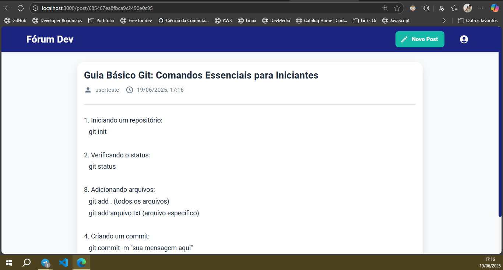

# Fórum Blog Pessoal

Aplicação web fullstack desenvolvida para registrar e compartilhar estudos de programação.
Frontend em React.js, backend com Express e MongoDB, e autenticação via JWT.

## Tecnologias

### Frontend
- React.js
- Material-UI
- React Router
- Axios

### Backend
- Node.js
- Express
- Mongoose
- JWT
- bcrypt
- MongoDB Atlas

## Funcionalidades

### Implementadas
- Cadastro e autenticação de usuários
- Login com geração de token JWT
- Proteção de rotas
- CRUD completo de posts
- Upload e exibição de imagens (até 5MB)
- Sistema de tags para categorização
- Formatação de datas no padrão brasileiro
- Compressão de respostas para melhor performance
- Interface responsiva e moderna
- Logout e exibição de usuário logado

### Em Desenvolvimento
- Comentários em posts
- Sistema de curtidas
- Filtro por tags
- Edição de perfil de usuário
- Modo escuro/claro

## Screenshots



## Como Executar

### Backend
1. Instale as dependências:
```bash
cd backend
npm install
```

2. Configure as variáveis de ambiente em um arquivo `.env`:
```
MONGO_URI=sua_uri_do_mongodb
JWT_SECRET=seu_segredo_jwt
PORT=5000
```

3. Inicie o servidor:
```bash
npm run dev
```

### Frontend
1. Instale as dependências:
```bash
cd frontend
npm install
```

2. Inicie a aplicação:
```bash
npm start
```

A aplicação estará disponível em `http://localhost:3000`
